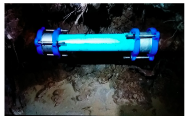
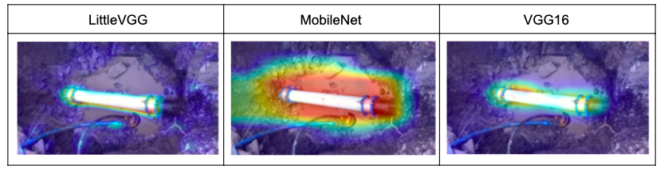
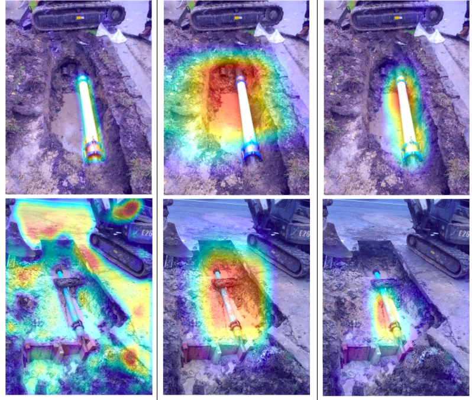

# **This project aims to build an Image Recognition Algorithm to increase the efficiency of the work order reviews in Water Industries**

Water and sewer mains pipes are distributed around Victoria. Every Year water industries receives numerous faulty repairs, majority being replacing burst main(broken pipe). Work order is approved by Water industries which includes reviewing the images. A minimum of 20 photos are attached for each repair, and at least 10,00,000 images are received every year. Approximately 30% of these images are reviewed manually for quality and work completion making it a tedious job. The main objective of the project is to decrease the time spent on approving the work order by use of automation.

  

**Objectives**

-To build an algorithm that is accurate. Our objective was to obtain 95% accuracy when classifying images.

-The algorithm will indicate for each image whether a new water main or new stop tap is present.

-The algorithm is quick. Once the algorithm is trained, it has to sort through at least 500 photos in less than 5 minutes. 

-The algorithm has to be quick inorder to save a significant amount of time for the employees. 

-The final objective was that the algorithm should be user friendly. No extensive prior knowledge of computer programming is required to use the algorithm.

Dataset
======

The data for this project was composed of images taken from various work sites by contractors responsible for repairing the faulty sites. The final set of images contained roughly 1,200 photos of burst water main as well as images of various other parts of work sites that came in with these pictures. These “other” images were useful in building our algorithms as they provided the data to classify our images against.

Data Preprocessing
======

-The computer reads the image as three matrices of pixel values. One each for the red, green and blue color index. Using the python package keras, the images were imported and reshaped to the same size. 

-The pixel values were then normalized between 0 and 1. 

-Using keras the dataset was split into training and test/validation data based on a percentage. Here it was 80/20 split for training and validation data.

Building Algorithms
======

Once preprocessed, Image recognition algorithms were built using Convolutional Neural Networks(CNNs). CNNs are a type of deep learning that contain convolutional layers used to pick up patterns in the data, that otherwise might not be seen. 

Using the best deep learning library keras, deep convolutional networks were built. Convolutional neural networks are composed of convolutional layer, a pooled layer and a fully connected layer. The convolutional layer is the important part of Convolutional neural network as it extracts features images or feature maps. Each convolutional layer can consist of multiple convolutional kernels  which extracts multiple features. A pooling layer is typically sandwiched between two convolutional layers, which reduces the dimensions of the feature map and maintains the scale invariance. The fully connected layer integrates the result after the image as been passed through multiple convolutional layers and pooling layers to obtain the high-layer semantic feature for image classification.

The first attempt at providing accurate classifiers started with building these CNNs from scratch. Building the CNNs does not necessarily mean that the architecture of the algorithm was created. It simply implies that the algorithm was trained exclusively on data provided. Different combinations of Convolutional and non Convolutional layers were attempted but discovered that the best results was from using the architecture of the littleVGG network. This network consisted of 7 blocks of convolutions, each ending with dropout layer for regularization to help prevent overfitting.

When training the models several tools were used to prevent overfitting to the training data. After each step (called epoch) the algorithm uses the validation data set to test the algorithm. If the algorithm goes through a set amount of epochs without decreasing the loss function value, the algorithm will end training and revert to the best weights (lowest loss value on validation data). It can be observed from the above figure that the decrease in the loss values and increase in accuracy as the model progresses.

As it can be observed the loss dips quickly at the start and slower as time goes on. Eventually at epoch 38, it hits the lowest loss value on the validation data. These are the weights that settle on for the algorithm, and are restored when the model finishes training. It’s important to keep these checks in place to guarantee our models accuracy will remain similar when used on new images.

code: https://gist.github.com/prakruthi333/55b29a76cda20d2626a5e277c0fc2f8f

Models Algorithms
======

After attempting to build the model from scratch, next was to build models using transfer learning. Transfer learning involves using a CNN's trained on another larger image data set, and applying it to your own images.

During the project, building a plethora of models were attempted using transfer learning. Three of the most popular were MobileNet, ResNet and VGG16. For each of these structured models were trained on the imagenet data set. All of the models plateaued over a much shorter amount of epochs. 

MobileNet was the most impressive, hitting its highest validation loss score at only the 3rd epoch. These models had a tendency to quickly start overfitting to the training data. The most difficulty with ResNet, as it would quickly begin scoring in the 90+% accuracy on the training data, but maintaining a low accuracy on the validation data. As ResNet As ResNet had the most layers, it made sense that it would overfit with a small amount of images to train on.

Code(MobileNet):https://gist.github.com/prakruthi333/c5c5056ebb0b8cba6d39f6aedf6e995e

Code(Vgg16): https://gist.github.com/prakruthi333/68aec72d0e3da7a9bf322e55c281bbdd

Visualising Models
------
Once the models were trained it was important to inspect these classifiers, and attempt to verify their validity. One way this could be achieved was by visualizing what the models were making their decisions on. This was done by creating heat maps that highlighted important pixel clusters. A function was created that found based on the last convolutional layer. The higher this value, the more these pixels had an effect on the final result. In this way, it would take individual images and look at what pixel clusters made them classify the image the way it did. This tool was used to double check.  However, if the object that is the subject of the classification is playing the primary role on the classification it strengthens the confidence in the algorithms results.

Code: https://gist.github.com/prakruthi333/e9877c6c57994afdcf14fb2bcabbfd02

Results
======
After building the models, it was checked on the test data set. This is a set of images that the algorithms had not seen,hence to check th4 performance. Similar to the results from our validation data, the models built using transfer learning performed better than the models LittleVGG. Looking at the VGG16 model, MobileNet model, and LittleVGG model trained only on the data of pipes, it showed that the VGG16 model outperformed the others when comparing overall accuracy.

Although VGG16 scored a higher accuracy, it’s important to look past this score and take in all of the information in this project. it was observed that the VGG16 algorithm has the highest f1 score for classifying burst pipes, as well as high precision and recall scores.  

 The MobileNet does not have a high recall score for classifying these, but as an extremely high precision. For each of the algorithms, the recall score for classifying burst pipes was higher.

The algorithm built without the use of transfer learning scored the lowest accuracy, and recall scores lower than the other two algorithms. 

It can also be observed that the accuracies follow a general trend in VGG16 than MobileNet which is better than LittleVGG. It can be noted that in both the MobileNet and VGG16 there is a dip from training and validation to test data. This is less than 3% for the VGG16 model, but MobileNet’s accuracy dips over 7% from validation to test data. As early stopping was used based on the validation data, this is important to note that it may imply overfitting to validation data.

------

